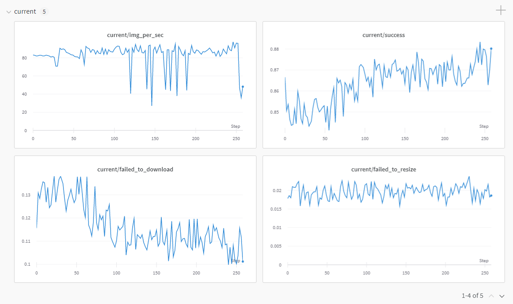
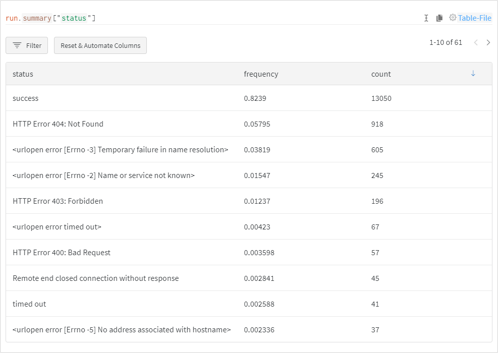

# img2dataset
[](https://pypi.python.org/pypi/img2dataset)
[](https://colab.research.google.com/github/rom1504/img2dataset/blob/master/notebook/img2dataset_getting_started.ipynb)
[](https://gitpod.io/#https://github.com/rom1504/img2dataset)
[](https://discord.gg/eq3cAMZtCC)

Easily turn large sets of image urls to an image dataset.
Can download, resize and package 100M urls in 20h on one machine.

Also supports saving captions for url+caption datasets.

If you believe in making reusable tools to make data easy to use for ML and you would like to contribute, please join the [DataToML](https://discord.gg/ep8yUUtCnp) chat.

## Install

```bash
pip install img2dataset
```

For better performance, it's highly recommended to set up a fast dns resolver, see [this section](https://github.com/rom1504/img2dataset#setting-up-a-high-performance-dns-resolver)

## Opt-out directives

Websites can pass the http headers `X-Robots-Tag: noai`, `X-Robots-Tag: noindex` , `X-Robots-Tag: noimageai` and `X-Robots-Tag: noimageindex`
By default img2dataset will ignore images with such headers.

To disable this behavior and download all images, you may pass --disallowed_header_directives '[]'

See [AI use impact](#ai-use-impact) to understand better why you may decide to enable or disable this feature.

## Examples

Example of datasets to download with example commands are available in the [dataset_examples](dataset_examples) folder. In particular:
* [mscoco](dataset_examples/mscoco.md) 600k image/text pairs that can be downloaded in 10min
* [sbucaptions](dataset_examples/SBUcaptions.md) 860K image/text pairs can be downloaded in 20 mins.
* [cc3m](dataset_examples/cc3m.md) 3M image/text pairs that can be downloaded in one hour
* [cc12m](dataset_examples/cc12m.md) 12M image/text pairs that can be downloaded in five hour
* [laion400m](dataset_examples/laion400m.md) 400M image/text pairs that can be downloaded in 3.5 days
* [laion5B](dataset_examples/laion5B.md) 5B image/text pairs that can be downloaded in 7 days using 10 nodes
* [laion-aesthetic](dataset_examples/laion-aesthetic.md) Laion aesthetic is a 120M laion5B subset with aesthetic > 7 pwatermark < 0.8 punsafe < 0.5
* [laion-art](dataset_examples/laion-art.md) Laion aesthetic is a 8M laion5B subset with aesthetic > 8 pwatermark < 0.8 punsafe < 0.5
* [laion-coco](dataset_examples/laion-coco.md) Laion-COCO is a 600M subset of LAION2B-EN, captioned with an ensemble of BLIP L/14 and 2 CLIP versions (L/14 and RN50x64).
* [laion-high-resolution](dataset_examples/laion-high-resolution.md) Laion high resolution is a 170M resolution >= 1024x1024 subset of laion5B
* [laion-face](dataset_examples/laion-face.md) Laion face is the human face subset of LAION-400M for large-scale face pretraining. It has 50M image-text pairs.
* [coyo-700m](dataset_examples/coyo-700m.md) COYO is a large-scale dataset that contains 747M image-text pairs as well as many other meta-attributes to increase the usability to train various models.
* [commonpool](dataset_examples/common_pool.md) CommonPool is a large-scale dataset collected from CommonCrawl containing 12.8B image-text pairs.
* [datacomp-1b](dataset_examples/datacomp.md) DataComp-1B is a large-scale dataset with 1.4B image-text pairs filtered from CommonPool.

For all these examples, you may want to tweak the resizing to your preferences. The default is 256x256 with white borders.
See options below.

## Usage

First get some image url list. For example:

```bash
echo 'https://placekitten.com/200/305' >> myimglist.txt
echo 'https://placekitten.com/200/304' >> myimglist.txt
echo 'https://placekitten.com/200/303' >> myimglist.txt
```

Then, run the tool:

```bash
img2dataset --url_list=myimglist.txt --output_folder=output_folder --thread_count=64 --image_size=256
```

The tool will then automatically download the urls, resize them, and store them with that format:
* output_folder
    * 00000
        * 000000000.jpg
        * 000000001.jpg
        * 000000002.jpg

or as this format if choosing webdataset:
* output_folder
    * 00000.tar containing:
        * 000000000.jpg
        * 000000001.jpg
        * 000000002.jpg

with each number being the position in the list. The subfolders avoids having too many files in a single folder.

If **captions** are provided, they will be saved as 0.txt, 1.txt, ...

This can then easily be fed into machine learning training or any other use case.

Also .json files named 0.json, 1.json,... are saved with these keys:
* url
* caption
* key of the form 000010005 : the first 5 digits are the shard id, the last 4 are the index in the shard
* status : whether the download succeeded
* error_message
* width
* height
* original_width
* original_height
* exif

Also a .parquet file will be saved with the same name as the subfolder/tar files containing these same metadata.
It can be used to analyze the results efficiently.

.json files will also be saved with the same name suffixed by _stats, they contain stats collected during downloading (download time, number of success, ...)

## Python examples

Checkout these examples to call this as a lib:
* [simple_example.py](examples/simple_example.py)
* [pyspark_example.py](examples/pyspark_example.py)
* [distributed img2dataset tutorial](examples/distributed_img2dataset_tutorial.md)

## API

This module exposes a single function `download` which takes the same arguments as the command line tool:

* **url_list** A file with the list of url of images to download. It can be a folder of such files. (*required*)
* **image_size** The size to resize image to (default *256*)
* **output_folder** The path to the output folder. (default *"images"*)
* **processes_count** The number of processes used for downloading the pictures. This is important to be high for performance. (default *1*)
* **thread_count** The number of threads used for downloading the pictures. This is important to be high for performance. (default *256*)
* **resize_mode** The way to resize pictures, can be no, border or keep_ratio (default *border*)
  * **no** doesn't resize at all
  * **border** will make the image image_size x image_size and add a border
  * **keep_ratio** will keep the ratio and make the smallest side of the picture image_size
  * **keep_ratio_largest** will keep the ratio and make the largest side of the picture image_size
  * **center_crop** will keep the ratio and center crop the largest side so the picture is squared
* **resize_only_if_bigger** resize pictures only if bigger that the image_size (default *False*)
* **upscale_interpolation** kind of upscale interpolation used for resizing (default *"lanczos"*)
* **downscale_interpolation** kind of downscale interpolation used for resizing (default *"area"*)
* **encode_quality** encode quality from 0 to 100, when using png it is the compression factor from 0 to 9 (default *95*)
* **encode_format** encode format (default *jpg*)
  * **jpg** jpeg format
  * **png** png format
  * **webp** webp format
* **skip_reencode** whether to skip reencoding if no resizing is done (default *False*)
* **output_format** decides how to save pictures (default *files*)
  * **files** saves as a set of subfolder containing pictures
  * **webdataset** saves as tars containing pictures
  * **parquet** saves as parquet containing pictures as bytes
  * **tfrecord** saves as tfrecord containing pictures as bytes
  * **dummy** does not save. Useful for benchmarks
* **input_format** decides how to load the urls (default *txt*)
  * **txt** loads the urls as a text file of url, one per line
  * **txt.gz** loads the urls as a compressed (gzip) txt.gz with a list of url, one per line
  * **csv** loads the urls and optional caption as a csv
  * **csv.gz** loads the urls and optional caption, as a compressed (gzip) csv.gz
  * **tsv** loads the urls and optional caption as a tsv
  * **tsv.gz** loads the urls and optional caption, as a compressed (gzip) tsv.gz
  * **json** loads the urls and optional caption as a json
  * **json.gz** loads the urls and optional caption, as a compressed (gzip) json.gz
  * **jsonl** loads the urls and optional caption as a jsonl. see [jsonlines](https://jsonlines.org/) for more
  * **jsonl.gz** loads the urls and optional caption, as a compressed (gzip) jsonl.gz. see [jsonlines](https://jsonlines.org/) for more
  * **parquet** loads the urls and optional caption as a parquet
* **url_col** the name of the url column for parquet and csv (default *url*)
* **caption_col** the name of the caption column for parquet and csv (default *None*)
* **bbox_col** the name of the bounding box column. Bounding boxes are assumed to have format ```[x_min, y_min, x_max, y_max]```, with all elements being floats in *[0,1]* (relative to the size of the image). If *None*, then no bounding box blurring is performed (default *None*)
* **number_sample_per_shard** the number of sample that will be downloaded in one shard (default *10000*)
* **extract_exif** if true, extract the exif information of the images and save it to the metadata (default *True*)
* **save_additional_columns** list of additional columns to take from the csv/parquet files and save in metadata files (default *None*)
* **timeout** maximum time (in seconds) to wait when trying to download an image (default *10*)
* **enable_wandb** whether to enable wandb logging (default *False*)
* **wandb_project** name of W&B project used (default *img2dataset*)
* **oom_shard_count** the order of magnitude of the number of shards, used only to decide what zero padding to use to name the shard files (default *5*)
* **compute_hash** the hash of raw images to compute and store in the metadata, one of *None*, *md5*, *sha256*, *sha512* (default *sha256*)
* **verify_hash** if not *None*, then this is a list of two elements that will be used to verify hashes based on the provided input. The first element of this list is the label of the column containing the hashes in the input file, while the second one is the type of the hash that is being checked (default *None*)
* **distributor** choose how to distribute the downloading (default *multiprocessing*)
  * **multiprocessing** use a multiprocessing pool to spawn processes
  * **pyspark** use a pyspark session to create workers on a spark cluster (see details below)
  * **ray** use a ray cluster. See ray example.
* **subjob_size** the number of shards to download in each subjob supporting it, a subjob can be a pyspark job for example (default *1000*)
* **retries** number of time a download should be retried (default *0*)
* **disable_all_reencoding** if set to True, this will keep the image files in their original state with no resizing and no conversion, will not even check if the image is valid. Useful for benchmarks. To use only if you plan to post process the images by another program and you have plenty of storage available. (default *False*)
* **min_image_size** minimum size of the image to download (default *0*)
* **max_image_area** maximum area of the image to download (default *inf*)
* **max_aspect_ratio** maximum aspect ratio of the image to download (default *inf*)
* **incremental_mode** Can be "incremental", "overwrite" or "extend". For "incremental", img2dataset will download all the shards that were not downloaded, for "overwrite" img2dataset will delete recursively the output folder then start from zero, for "extend" img2dataset will download shards from the next available shard number (default *incremental*)
* **max_shard_retry** Number of time to retry failed shards at the end (default *1*)
* **user_agent_token** Additional identifying token that will be added to the User-Agent header sent with HTTP requests to download images; for example: "img2downloader". (default *None*)
* **disallowed_header_directives** List of X-Robots-Tags header directives that, if present in HTTP response when downloading an image, will cause the image to be excluded from the output dataset. To ignore x-robots-tags, pass '[]'. (default '["noai", "noimageai", "noindex", "noimageindex"]')

## Incremental mode

If a first download got interrupted for any reason, you can run again with --incremental "incremental" (this is the default) and using the same output folder , the same number_sample_per_shard and the same input urls, and img2dataset will complete the download.

## Output format choice

Img2dataset support several formats. There are trade off for which to choose:
* files: this is the simplest one, images are simply saved as files. It's good for up to 1M samples on a local file system. Beyond that performance issues appear very fast. Handling more than a million files in standard filesystem does not work well.
* webdataset: webdataset format saves samples in tar files, thanks to [webdataset](https://webdataset.github.io/webdataset/) library, this makes it possible to load the resulting dataset fast in both pytorch, tensorflow and jax. Choose this for most use cases. It works well for any filesystem
* parquet: parquet is a columnar format that allows fast filtering. It's particularly easy to read it using pyarrow and pyspark. Choose this if the rest of your data ecosystem is based on pyspark. [petastorm](https://github.com/uber/petastorm) can be used to read the data but it's not as easy to use as webdataset
* tfrecord: tfrecord is a protobuf based format. It's particularly easy to use from tensorflow and using [tf data](https://www.tensorflow.org/guide/data). Use this if you plan to use the dataset only in the tensorflow ecosystem. The tensorflow writer does not use fsspec and as a consequence supports only a limited amount of filesystem, including local, hdfs, s3 and gcs. It is also less efficient than the webdataset writer when writing to other filesystems than local, losing some 30% performance.

## Encode format choice

Images can be encoded in jpeg, png or webp, with different quality settings.

Here are a few comparisons of space used for 1M images at 256 x 256:

| format | quality | compression | size (GB)  |
| ------ | ------- | ----------- | ---------- |
| jpg    | 100     | N/A         | 54.2       |
| jpg    | 95      | N/A         | 29.9       |
| png    | N/A     | 0           | 187.9      |
| png    | N/A     | 9           | 97.7       |
| webp   | 100     | N/A         | 31.0       |
| webp   | 95      | N/A         | 23.8       |

Notes:

* jpeg at quality 100 is NOT lossless
* png format is lossless
* webp at quality >100 is lossless ([see OpenCV Docs](https://docs.opencv.org/3.4/d8/d6a/group__imgcodecs__flags.html))
* same quality scale between formats does not mean same image quality

## Filtering the dataset

Whenever feasible, you should pre-filter your dataset prior to downloading.

If needed, you can use:
* --min_image_size SIZE : to filter out images with one side smaller than SIZE
* --max_image_area SIZE : to filter out images with area larger than SIZE
* --max_aspect_ratio RATIO : to filter out images with an aspect ratio greater than RATIO

When filtering data, it is recommended to pre-shuffle your dataset to limit the impact on shard size distribution.

## Hashes and security

Some dataset (for example laion5B) expose hashes of original images.

If you want to be extra safe, you may automatically drop out the images that do not match theses hashes.
In that case you can use `--compute_hash "md5" --verify_hash '["md5","md5"]'` 
Some of those images are actually still good but have been slightly changed by the websites.

## How to tweak the options

The default values should be good enough for small sized dataset. For larger ones, these tips may help you get the best performance:

* set the processes_count as the number of cores your machine has
* increase thread_count as long as your bandwidth and cpu are below the limits
* I advise to set output_format to webdataset if your dataset has more than 1M elements, it will be easier to manipulate few tars rather than million of files
* keeping metadata to True can be useful to check what items were already saved and avoid redownloading them

To benchmark your system, and img2dataset interactions with it, it may be interesting to enable these options (only for testing, not for real downloads)
* --output_format dummy : will not save anything. Good to remove the storage bottleneck
* --disable_all_reencoding True : will not reencode anything. Good to remove the cpu bottleneck
When both these options are enabled, the only bottlenecks left are network related: eg dns setup, your bandwidth or the url servers bandwidth.

## File system support

Thanks to [fsspec](https://filesystem-spec.readthedocs.io/en/latest/), img2dataset supports reading and writing files in [many file systems](https://github.com/fsspec/filesystem_spec/blob/6233f315548b512ec379323f762b70764efeb92c/fsspec/registry.py#L87).
To use it, simply use the prefix of your filesystem before the path. For example `hdfs://`, `s3://`, `http://`, `gcs://`, `ssh://` or `hf://` (includes a [Dataset Viewer](https://huggingface.co/docs/hub/datasets-viewer)).
Some of these file systems require installing an additional package (for example s3fs for s3, gcsfs for gcs, [fsspec/sshfs](https://github.com/fsspec/sshfs) for ssh, [huggingface_hub](https://huggingface.co/docs/huggingface_hub/guides/hf_file_system) for hf).
See fsspec doc for all the details.

If you need specific configuration for your filesystem, you may handle this problem by using the [fsspec configuration system](https://filesystem-spec.readthedocs.io/en/latest/features.html#configuration) that makes it possible to create a file such as `.config/fsspec/s3.json` and have information in it such as:

```json
{
  "s3": {
    "client_kwargs": {
            "endpoint_url": "https://some_endpoint",
            "aws_access_key_id": "your_user",
           "aws_secret_access_key": "your_password"
    }
  }
}
```

Which may be necessary if using s3 compatible file systems such as [minio](https://min.io/). That kind of configuration also work for all other fsspec-supported file systems.

## Distribution modes

Img2dataset supports several distributors.
* multiprocessing which spawns a process pool and use these local processes for downloading
* pyspark which spawns workers in a spark pool to do the downloading

multiprocessing is a good option for downloading on one machine, and as such it is the default.
Pyspark lets img2dataset use many nodes, which makes it as fast as the number of machines.
It can be particularly useful if downloading datasets with more than a billion image.

### pyspark configuration

In order to use img2dataset with pyspark, you will need to do this:
1. `pip install pyspark`
2. use the `--distributor pyspark` option
3. tweak the `--subjob_size 1000` option: this is the number of images to download in each subjob. Increasing it will mean a longer time of preparation to put the feather files in the temporary dir, a shorter time will mean sending less shards at a time to the pyspark job.

By default a local spark session will be created.
You may want to create a custom spark session depending on your specific spark cluster.
To do that check [pyspark_example.py](examples/pyspark_example.py), there you can plug your custom code to create a spark session, then
run img2dataset which will use it for downloading.

To create a spark cluster check the [distributed img2dataset tutorial](examples/distributed_img2dataset_tutorial.md)

## Integration with Weights & Biases

To enable wandb, use the `--enable_wandb=True` option.

Performance metrics are monitored through [Weights & Biases](https://wandb.com/).



In addition, most frequent errors are logged for easier debugging.



Other features are available:

* logging of environment configuration (OS, python version, CPU count, Hostname, etc)
* monitoring of hardware resources (GPU/CPU, RAM, Disk, Networking, etc)
* custom graphs and reports
* comparison of runs (convenient when optimizing parameters such as number of threads/cpus)

When running the script for the first time, you can decide to either associate your metrics to your account or log them anonymously.

You can also log in (or create an account) before by running `wandb login`.

## Road map

This tool works very well in the current state for up to 100M elements. Future goals include:

* a benchmark for 1B pictures which may require
  * further optimization on the resizing part
  * better multi node support
  * integrated support for incremental support (only download new elements)

## Architecture notes

This tool is designed to download pictures as fast as possible.
This put a stress on various kind of resources. Some numbers assuming 1350 image/s:
* Bandwidth: downloading a thousand average image per second requires about 130MB/s
* CPU: resizing one image may take several milliseconds, several thousand per second can use up to 16 cores
* DNS querying: million of urls mean million of domains, default OS setting usually are not enough. Setting up a local bind9 resolver may be required
* Disk: if using resizing, up to 30MB/s write speed is necessary. If not using resizing, up to 130MB/s. Writing in few tar files make it possible to use rotational drives instead of a SSD.

With these information in mind, the design choice was done in this way:
* the list of urls is split in K shards. K is chosen such that a shard has a reasonable size on disk (for example 256MB), by default K = 10000
* N processes are started (using multiprocessing process pool)
  * each process starts M threads. M should be maximized in order to use as much network as possible while keeping cpu usage below 100%.
  * each of this thread download 1 image and returns it
  * the parent thread handle resizing (which means there is at most N resizing running at once, using up the cores but not more)
  * the parent thread saves to a tar file that is different from other process

This design make it possible to use the CPU resource efficiently by doing only 1 resize per core, reduce disk overhead by opening 1 file per core, while using the bandwidth resource as much as possible by using M thread per process.

Also see [architecture.md](img2dataset/architecture.md) for the precise split in python modules.

## Setting up a high performance dns resolver

To get the best performances with img2dataset, using an efficient dns resolver is needed.
* knot resolver can run in parallel
* bind resolver is the historic resolver and is mono core but very optimized


### Setting up a knot resolver

Follow [the official quick start](https://knot-resolver.readthedocs.io/en/stable/quickstart-install.html) or run this on ubuntu:

install knot with

```bash
wget https://secure.nic.cz/files/knot-resolver/knot-resolver-release.deb
sudo dpkg -i knot-resolver-release.deb
sudo apt update
sudo apt install -y knot-resolver
sudo sh -c 'echo `hostname -I` `hostname` >> /etc/hosts'
sudo sh -c 'echo nameserver 127.0.0.1 > /etc/resolv.conf'
sudo systemctl stop systemd-resolved
```

then start 4 instances with

```bash
sudo systemctl start kresd@1.service
sudo systemctl start kresd@2.service
sudo systemctl start kresd@3.service
sudo systemctl start kresd@4.service
```

Check it works with

```bash
dig @localhost google.com
```

### Setting up a bind9 resolver

In order to keep the success rate high, it is necessary to use an efficient DNS resolver.
I tried several options: systemd-resolved, dnsmaskq and bind9 and reached the conclusion that bind9 reaches the best performance for this use case.
Here is how to set this up on Ubuntu. Run:

```bash
sudo apt install bind9
sudo vim /etc/bind/named.conf.options
```

And add this in `options`:

```
	recursive-clients 10000;
	resolver-query-timeout 30000;
	max-clients-per-query 10000;
	max-cache-size 2000m;
```

Then, run:

```bash
sudo systemctl restart bind9
echo nameserver 127.0.0.1 | sudo tee -a /etc/resolv.conf
```

This will make it possible to keep an high success rate while doing thousands of dns queries.
You may also want to [setup bind9 logging](https://nsrc.org/activities/agendas/en/dnssec-3-days/dns/materials/labs/en/dns-bind-logging.html) in order to check that few dns errors happen.


## AI use impact

img2dataset is used to retrieve images from the web and make them easily available for ML use cases. Use cases involve:
* doing inference and indexing to better understand what is in the web (https://rom1504.github.io/clip-retrieval/ is an example of this)
* training models

Models that can be trained using image/text datasets include:
* CLIP: an image understanding model that allow for example to know whether an image is safe, aesthetic, what animal it contains, ...
* text to image models: generating images based on text

There is a lot of discussions regarding the consequences of text to image models. Some opinions include:
* AI art is democratizing art and letting hundred of millions of people express themselves through art. Making art much more prevalent and unique
* AI models should not be trained on images that creator do not want to share

The opt out directive try to let creators that do not want to share their art not be used for indexing and for training.


## For development

Either locally, or in [gitpod](https://gitpod.io/#https://github.com/rom1504/img2dataset) (do `export PIP_USER=false` there)

Setup a virtualenv:

```bash
python3 -m venv .env
source .env/bin/activate
pip install -e .
```

to run tests:

```bash
pip install -r requirements-test.txt
```
then

```bash
make lint
make test
```

You can use `make black` to reformat the code

`python -m pytest -x -s -v tests -k "dummy"` to run a specific test

## Benchmarks

### 10000 image benchmark

```bash
cd tests/test_files
bash benchmark.sh
```


### 18M image benchmark

Download crawling at home first part, then:

```bash
cd tests
bash large_bench.sh
```

It takes 3.7h to download 18M pictures

1350 images/s is the currently observed performance. 4.8M images per hour, 116M images per 24h.


### 36M image benchmark

downloading 2 parquet files of 18M items (result 936GB) took 7h24
average of 1345 image/s

### 190M benchmark

downloading 190M images from the [crawling at home dataset](https://github.com/rom1504/cah-prepro) took 41h (result 5TB)
average of 1280 image/s

### 5B benchmark

downloading 5.8B images from the [laion5B dataset](https://laion.ai/laion-5b-a-new-era-of-open-large-scale-multi-modal-datasets/) took 7 days (result 240TB), average of 9500 sample/s on 10 machines, [technical details](https://rom1504.medium.com/semantic-search-at-billions-scale-95f21695689a)


## Citation

```bibtex
@misc{beaumont-2021-img2dataset,
  author = {Romain Beaumont},
  title = {img2dataset: Easily turn large sets of image urls to an image dataset},
  year = {2021},
  publisher = {GitHub},
  journal = {GitHub repository},
  howpublished = {\url{https://github.com/rom1504/img2dataset}}
}
```
